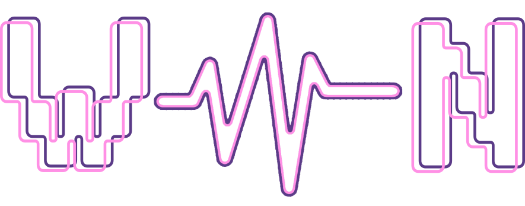

 - Vincenzo Joyce (x00215902)
 - Collin Macauley (x00213729)

This is a CA project for Software Development. The task is to built a e-commerce web-app with the Django framework.

# Model

# Programs Used
- **Graphics and Design**: GIMP, Inkscape

# Colors
The colours are generated within the OKLAB perceptual color space following an analagous scheme:
 - #01071d
 - #0d1239
 - #29225e
 - #5b3b88
 - #a85eb5
 - #ff90e5

# Fonts
- **VP Pixel and VP Pixel Pro Outline** by VP Type (1001 fonts)

# Work log - Collin Macauley (x00213729)
No Date tracked
 - Accounts setup

Changelog - 23/11/2024
 - project/urls.py updated for accounts
 - product models added
 - sign up pages raw
 - shop app
 - all urls updated
 - shop app models, ulrs, views

To Do list
 - migrate shop app
 - add other models to shop

Changelog - 27/11/2024
 - fixed image link
 - added fixtures and json to shop
 - added fixtures and json to accounts
 - updated accounts to add managers and customers
 - Wiped all migrations and remade
 - made user profiles

image should be jpeg
Set image size to 250 x 250 px for products
Use google extension save image as

# Managers: 
    Collin
    Username - collin
    Password - collin

    test email for cart = collin@gmail.com

    Vin
    Username - Manager_Vin
    Password - Management123

# Hosting
http://127.0.0.1:8080/

# Python anywhere
link: jkvince.pythonanywhere.com